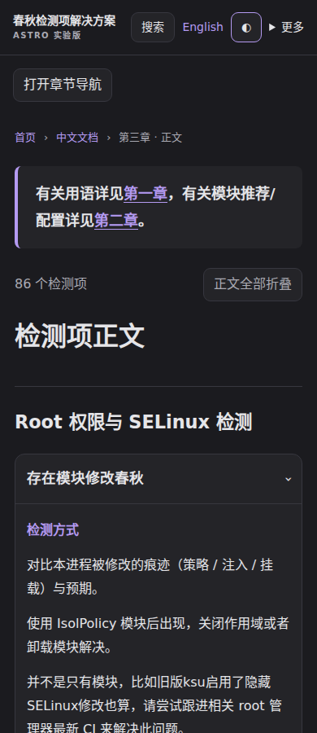

# Astro 实验版（不替换正式站）

**独立原型，现有 VitePress 和 Pages 工作流不变。** 只读取仓库根目录 `language/` 与 `File/`，不复制维护第二份文档。

## 参考与署名

参考 [Matsuzaka Yuki 的 Astro 原型](https://github.com/matsuzaka-yuki/Chunqiu-Detector-Problem-solution/tree/784fa4cbf88de60051f59f02e3b77db9c655ed03) 的“构建期结构化内容 → 静态组件 → 原生 details”设计思路。本目录是新的实现，不是将其主题直接搬过来；保留三章路径和现有标题锚点，不使用“有解决办法标题 = 已解决”的徽标判定，也不加载外部字体。原仓库许可证保持不变。

## 预览




上图由 Linux Chromium 实际渲染（系统 Noto CJK 字体）。默认响应式，不再默认强制 1024px 桌面视口；更多菜单仍能选择桌面/手机视图。**手机真机、Safari 和 Firefox 尚未验收。**

```sh
# Node.js >=22.12，从仓库根目录开始
cd experiments/astro
npm ci
npm run build
npm test
npm run preview
# 打开 http://localhost:4321/Chunqiu-Detector-Problem-solution/
```

`npm run dev` 用于开发；附件复制发生在 build 阶段，首次开发如需附件请先运行 `node scripts/assets.mjs`。

`SITE_URL` / `BASE_PATH` 控制部署域名和前缀，默认值兼容本 fork。主页 `/`、中英文 `/zh/` / `/en/`、`prologue/`、`items/` 和 `/thanks/` 均保留。不是 SPA，不靠客户端路由拦截链接。原型设有 `noindex`，暂不作为 SEO 正式版本。

实验分支的 **Astro prototype checks** Action 只测试、上传静态站与截图 artifact，**不部署、不请求 Pages 写权限**。可下载 artifact，在 `site` 目录的上一级创建 `Chunqiu-Detector-Problem-solution` 目录并把站点文件放进去，使用静态 HTTP 服务预览（不能直接双击 HTML 测搜索）。

## 内容与交互

- Markdown token 级分章，代码块中的 `#` 不会误当标题。
- 当前正文：86 个检测项 + 3 个附录条目，89 个完整原生折叠框；打开页面默认全部展开。
- 标题 ID 与同源 VitePress 六页比对通过；分章后跨章锚点重写；附件文件原样复制。
- 搜索首次输入关键词才下载当前语言索引；精确标题 > 标题包含 > 正文包含；140ms 防抖；失败可重试。
- 顶栏/侧栏/正文统一底色；独立导航与正文折叠；没有右侧文章目录。
- 无 Vue/React 客户端运行时；无 CDN 字体；无轮询；原生 JS 用于主题、菜单、搜索、折叠和锚点展开。
- 关闭 JS 后仍可阅读、折叠和使用普通链接，搜索等增强功能隐藏。

## 实测与限制

同一份 fork 文档分别构建、本地 Chromium 1440×900 冷加载中文正文，等待 networkidle 后再等 2 秒；没有触发搜索：

| 指标 | 现有 VitePress | 本原型 |
|---|---:|---:|
| 成功资源请求数 | 15 | 2 |
| 资源体积（解压后） | 698727 B | 108987 B |
| 对响应逐个 gzip 的估算 | 291755 B | 33267 B |

数据为原型首轮测量，后续小修可能变化。包含文档、字体、脚本、样式和预加载；原型 JS 已算在 HTML 中。**不是互联网测速，不代表 LCP 或实际 Pages 压缩率；本原型尚无现有站点全部功能，不能归因于框架优劣。** 系统字体、较少装饰和不预加载其他页面也贡献了差异。

已测：
- 六页链接/锚点/ID 唯一性、89 个完整折叠框、语言索引隔离；
- Chromium 390 / 1024 / 1440px × light / dark；
- 标题优先搜索、语言切换对应路径、锚点自动展开、独立折叠、手机导航、无横向溢出、主题切换、无页面 JS 异常；
- 禁用 JS 后正文阅读与原生折叠。

```sh
npx playwright install --with-deps chromium
npm run test:browser
# 比较要求先在根目录构建当前 VitePress
npm run benchmark
```

未完成：跨浏览器与真机验收、完整无障碍评估、全套视觉回归、所有历史外链形态兼容、正式部署/SEO策略。暂不切换正式站。
